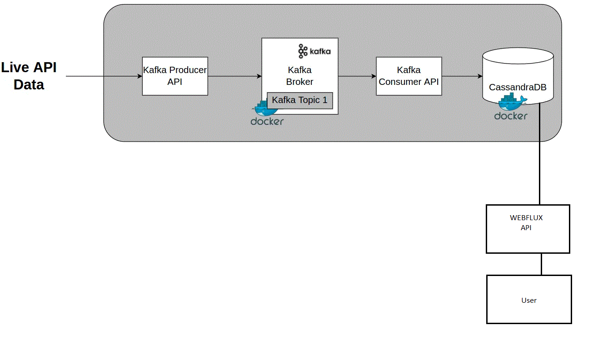

# Assignment for Relay42 Company
Project to consume sensor details from Kafka producer and store in DB. Provide api to search on sensor details.

This application was generated  by Alireza Zabetan
[alireza.zabetan@gmail.com](alireza.zabetan@gmail.com).

## Development

## Technologies

- **[Spring Webflux](https://docs.spring.io/spring/docs/current/spring-framework-reference/web-reactive.html)**
- **[Maven](https://maven.apache.org/)**
- Java 11
- Kafka / Spring cloud stream
- Cassandra / Reactive connector
- Spring security
- lombok
- mapstruct

## Getting Started

### Requirements

- Docker
  - Needed in case you want to run it with Docker.
- Java 11
  - Need have the JAVA_HOME set in case you want to execute via Maven

### Building

At the project root folder, execute:

```shell
maven clean install
```

### Run in local
#### 1- Run CassandraDB
First of need to connect to cassandra DB. There is 2 options:
    1- Download and install Cassandra on your local machine
      [Download Cassandra](https://cassandra.apache.org/_/download.html )
    2- Use docker to bring up the cassandra docker image
```shell
    docker pull cassandra
    docker run --name cassandra -p 127.0.0.1:9042:9042 -p 127.0.0.1:9160:9160   -d cassandra
 ```
#### 2- Run Server

Please run the command
```shell
    mvn spring-boot:run
 ```
Or 

```
    java -jar target/sensor-0.0.1-SNAPSHOT.jar
```

### Run with Docker

Make sure, producer is up and running ([Producer repository](https://github.com/operations-relay42/iot-producer-simulator-api ))

- Run the docker compose file

```
    docker-compose -f "docker-compose.yml" up --build -d
```

##Test the api 
cUrl

```
curl -X GET \
  'http://ip:port/consumer-api/sensors/{operation}?fromDate=2022-01-16&toDate=2022-01-20' \
  -H 'Authorization: Basic dXNlcjp1c2Vy' \
  -H 'Content-Type: application/json' \
  -H 'cache-control: no-cache'
```

### Example
Minimum operation

```
curl -X GET \
  'http://127.0.0.1:6688/sensor/api/even-messages/MIN?fromDate=2022-01-16&toDate=2022-07-16' \
  -H 'Authorization: Basic dXNlcjp1c2Vy' \
  -H 'Content-Type: application/json' \
  -H 'cache-control: no-cache'
```

Maximum operation

```
curl -X GET \
  'http://127.0.0.1:6688/sensor/api/even-messages/MAX?fromDate=2022-01-16&toDate=2022-07-16' \
  -H 'Authorization: Basic dXNlcjp1c2Vy' \
  -H 'Content-Type: application/json' \
  -H 'cache-control: no-cache'
```

Average operation

```
curl -X GET \
  'http://127.0.0.1:6688/sensor/api/even-messages/AVERAGE?fromDate=2022-01-16&toDate=2022-07-16' \
  -H 'Authorization: Basic dXNlcjp1c2Vy' \
  -H 'Content-Type: application/json' \
  -H 'cache-control: no-cache'
```

Median operation

```
curl -X GET \
  'http://127.0.0.1:6688/sensor/api/even-messages/MEDIAN?fromDate=2022-01-16&toDate=2022-07-16' \
  -H 'Authorization: Basic dXNlcjp1c2Vy' \
  -H 'Content-Type: application/json' \
  -H 'cache-control: no-cache'
```

## Design and Architecture


* Kafka consumer consumes stream from producer and store it in database. In order to implement that I've been using :

- Use spring kafka because it applies core Spring concepts to the development of Kafka-based messaging solutions. It provides a "template" as a high-level abstraction for sending messages. It also provides support for Message-driven POJOs with @KafkaListener annotations and a "listener container".
- database and IO operations are blocking however, when it comes to streaming non-blocking is better choice so r2dbc cassandra connector has been used which provided by spring cassandra reactive library


TODOs :

- For making an endpoint secure , http basic mechanism has been used which can be improved by jwt token and auth server implementation.
- Provide user management system to and store user data in real DB 
- Make separate the consumer service and Api so they will not depend on each other and easy to scale
- Create docker volumes to keep data after docker restart


    
